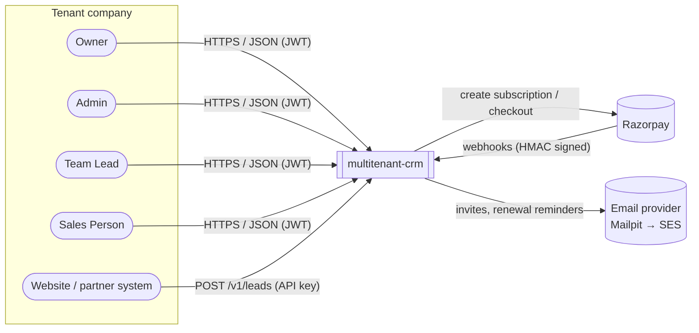
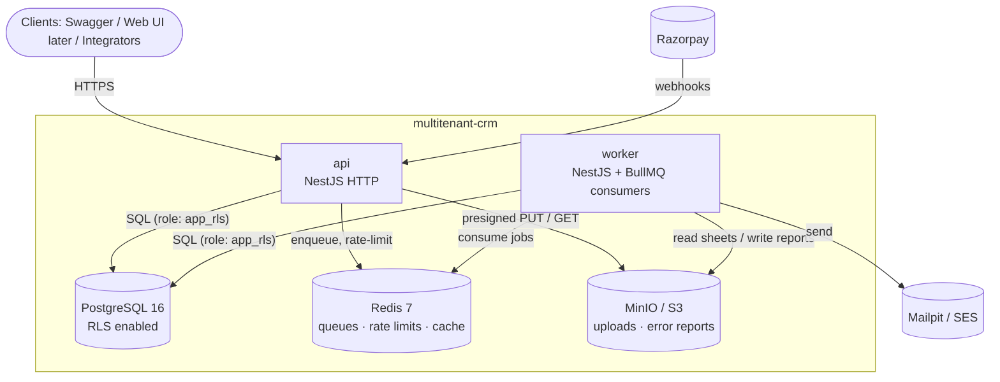
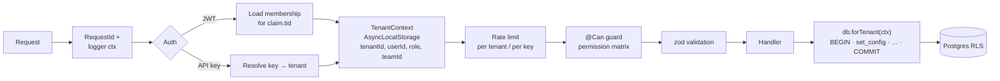
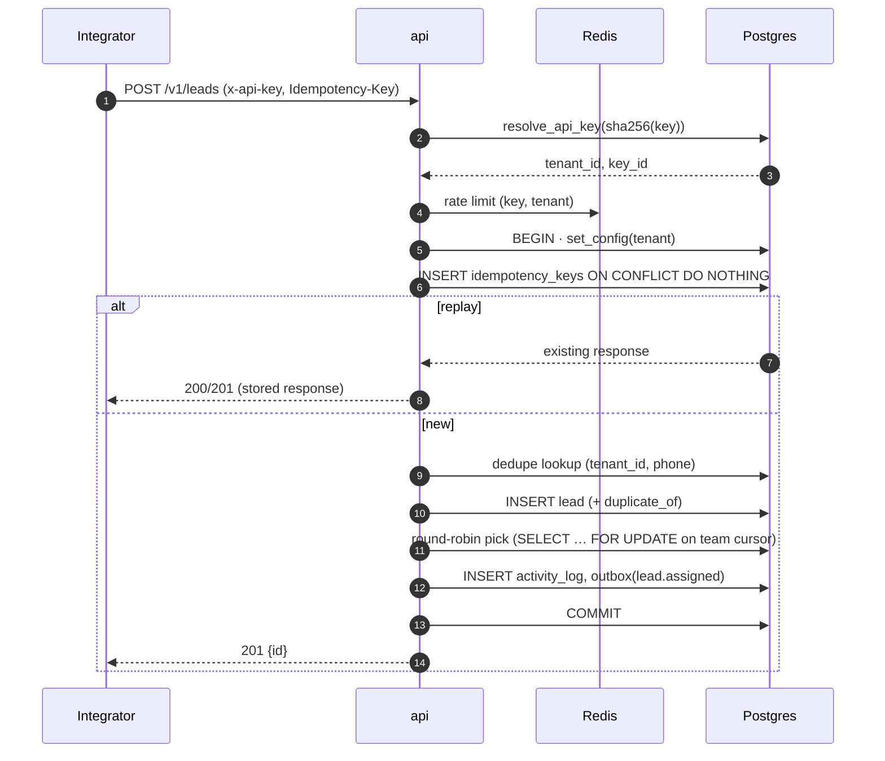
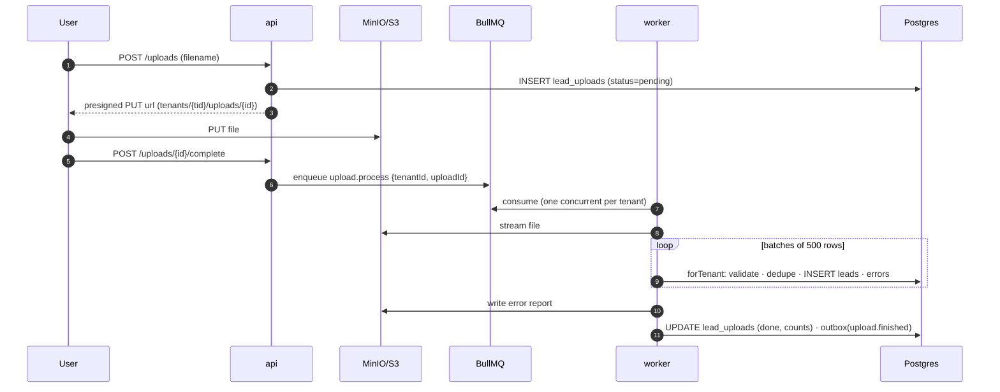
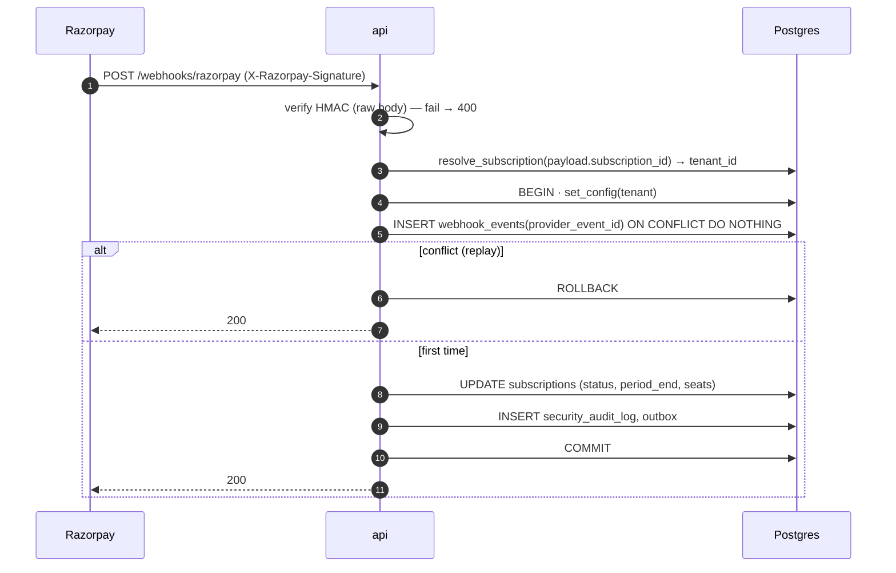
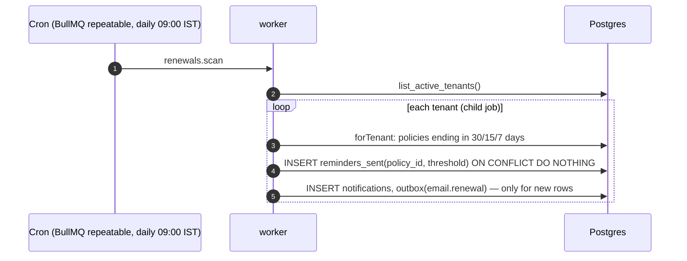

# 03 — High-Level Design (HLD)

| Field | Value |
|---|---|
| Project | multitenant-crm |
| Author / Owner | Digvijay Singh |
| Status | Approved v1.0 |
| Last updated | 2026-09-28 |
| Depends on | [01-prd.md](./01-prd.md), [02-nfr.md](./02-nfr.md) |
| ADRs | [adr/](./adr/README.md) |

---

## 1. Architecture summary

- **Style:** a modular monolith (NestJS) deployed as **two processes** from one codebase: `api` (HTTP) and `worker` (background jobs).
- **Tenancy model:** one shared database and shared schema. Every tenant-owned row has `tenant_id`, enforced by **three layers**: tenant resolved in middleware → scoped data layer → Postgres RLS.
- **State:** PostgreSQL is the system of record. Redis handles queues, rate limits and short-lived cache. S3/MinIO stores uploaded sheets and error reports.
- **Async work:** BullMQ jobs, fed by a **transactional outbox** so that side effects happen exactly when the data change commits.

## 2. System context (C4 — Level 1)



## 3. Containers (C4 — Level 2)



| Container | Responsibility | Scales by |
|---|---|---|
| **api** | Auth, tenant resolution, permissions, validation, CRUD, webhook intake, enqueueing | Horizontal (stateless) |
| **worker** | Sheet parsing, outbox relay, emails, renewal scheduler, round-robin catch-up | Horizontal (queue consumers) |
| **PostgreSQL** | System of record, RLS enforcement, audit tables | Vertical, then read replicas |
| **Redis** | BullMQ queues, sliding-window rate limits, idempotency cache | Vertical |
| **MinIO / S3** | Uploaded sheets and error reports under `tenants/{tenantId}/…` | Managed |

## 4. Tech stack

| Concern | Choice | ADR |
|---|---|---|
| Language | TypeScript (strict), Node.js 22 LTS | — |
| Framework | NestJS 11 on the Fastify adapter | [ADR-003](./adr/003-nestjs.md) |
| Data access | Kysely + `pg` | [ADR-004](./adr/004-kysely.md) |
| Migrations | Kysely migrations (SQL-first) | [ADR-004](./adr/004-kysely.md) |
| Database | PostgreSQL 16 | [ADR-002](./adr/002-shared-schema-rls.md) |
| Queue | BullMQ on Redis 7 | [ADR-005](./adr/005-bullmq.md) |
| Validation | zod (+ `nestjs-zod` for OpenAPI) | — |
| Auth | Own JWT (access) + rotating refresh tokens; argon2id | [ADR-007](./adr/007-own-auth.md) |
| Tenant context | `AsyncLocalStorage` | [ADR-006](./adr/006-tenant-resolution.md) |
| Sheets | `exceljs` / `csv-parse` (streaming) | — |
| Payments | Razorpay Subscriptions (test mode) | PRD D5 |
| Logging / tracing | pino, OpenTelemetry | — |
| Testing | Vitest, Supertest, Testcontainers (real Postgres), k6 | — |
| Repo | pnpm workspaces monorepo | [ADR-001](./adr/001-modular-monolith.md) |
| Frontend (later) | Next.js | — |

## 5. Module breakdown

Each NestJS module owns its tables and exposes a service interface. Modules never query another module's tables directly.

| Module | Owns (tables) | Responsibility |
|---|---|---|
| `auth` | `users`, `refresh_tokens` | Signup, login, refresh rotation, switch tenant |
| `tenancy` | `tenants`, `memberships` | Tenant create (with owner), membership lookup, ownership transfer |
| `invites` | `invites` | Create, revoke, accept (single-use) |
| `teams` | `teams`, `team_members` | Teams, team lead, availability toggle |
| `access` | — (code: permission matrix) | `@Can('lead.assign')` guard; scope resolution (T / Tm / Own) |
| `api-keys` | `api_keys` | Issue, hash, revoke, resolve key → tenant |
| `leads` | `leads`, `lead_notes` | CRUD, dedupe, pipeline transitions, assignment, round-robin |
| `ingestion` | `idempotency_keys` | `POST /v1/leads` with idempotency |
| `uploads` | `lead_uploads`, `lead_upload_errors` | Presigned upload, job, row errors, report |
| `policies` | `policies` | Convert lead → policy |
| `renewals` | `reminders_sent` | Daily scheduler, 30/15/7-day thresholds |
| `activity` | `activity_log` | Append-only change history for leads and policies |
| `audit` | `security_audit_log` | Append-only security events |
| `notifications` | `notifications` | In-app inbox |
| `outbox` | `outbox` | Transactional outbox + relay to BullMQ |
| `billing` | `subscriptions`, `webhook_events` | Razorpay checkout, webhook intake, plan limits |
| `dashboard` | — (read models) | Aggregates within scope |
| `platform` | — | Health, config, logging, tracing, rate limiting, error filter |

## 6. Request pipeline (the isolation mechanism)

Every authenticated HTTP request passes through the same fixed chain:



| Step | Isolation layer | Rule |
|---|---|---|
| D / E → F | **Layer 1** | Tenant comes only from the verified JWT claim (checked against an active membership) or the API key. Body, query and header tenant ids are ignored. |
| H | Access control | One guard reads the permission matrix. Handlers never check roles. |
| K | **Layer 2** | `forTenant()` is the only way to reach the DB. It opens a transaction and runs `set_config('app.tenant_id', $1, true)`. Repositories also add `tenant_id` explicitly to every query. |
| L | **Layer 3** | RLS policy `tenant_id = current_setting('app.tenant_id', true)::uuid`, **forced** on every tenant table. |

Scope (T / Tm / Own from the PRD matrix) is applied inside repositories as an extra filter, e.g. a sales person's lead query adds `assignee_id = ctx.userId`.

## 7. Database roles and cross-tenant access

Some operations legitimately need to find a tenant *before* a tenant context exists: login, API key lookup, webhooks, and the renewal scheduler. These go through a small, audited set of `SECURITY DEFINER` functions instead of bypassing RLS.

| Role | Used by | Privileges |
|---|---|---|
| `app_owner` | Migrations only | Owns tables. Never used at runtime. |
| `app_rls` | api + worker | DML on tenant tables through RLS. `INSERT`/`SELECT` only on audit tables. No `BYPASSRLS`. |

| Function (SECURITY DEFINER) | Purpose | Returns |
|---|---|---|
| `auth_find_user(email)` | Login | User row (global table) |
| `auth_list_memberships(user_id)` | "My workspaces", switch tenant | `(tenant_id, role, name)` |
| `resolve_api_key(hash)` | Ingestion auth | `(tenant_id, key_id)` or null |
| `resolve_invite(token_hash)` | Invite accept | `(tenant_id, email, role)` |
| `resolve_subscription(provider_ref)` | Razorpay webhook | `tenant_id` |
| `list_active_tenants()` | Scheduler fan-out | `tenant_id[]` |

Everything after the lookup runs through the normal `forTenant()` path, with RLS on.

## 8. Key flows

### 8.1 Lead ingestion via API



### 8.2 Sheet upload



### 8.3 Razorpay webhook (idempotent)



### 8.4 Renewal reminders



### 8.5 Transactional outbox

Business transactions write an `outbox` row next to their data change. The worker relays pending rows (polled with `FOR UPDATE SKIP LOCKED`) into BullMQ queues (`email`, `notification`) and marks them sent. Delivery is at least once, so consumers are idempotent on the outbox id.

## 9. Data classification

| Global (no RLS) | Tenant-owned (RLS forced) |
|---|---|
| `users`, `refresh_tokens`, `tenants` | `memberships`, `invites`, `teams`, `team_members`, `api_keys`, `leads`, `lead_notes`, `lead_uploads`, `lead_upload_errors`, `policies`, `reminders_sent`, `activity_log`, `security_audit_log`, `notifications`, `outbox`, `idempotency_keys`, `subscriptions`, `webhook_events` |

`webhook_events` gets its `tenant_id` from `resolve_subscription` before the insert. The full schema, keys and policies come in stage 4.

## 10. Repository layout

```
multitenant-crm/
├── apps/
│   ├── api/            # NestJS HTTP app (main.ts → api)
│   ├── worker/         # NestJS app context → BullMQ consumers + schedulers
│   └── web/            # Next.js (post-API)
├── packages/
│   ├── db/             # Kysely types, migrations, forTenant(), RLS helpers
│   ├── shared/         # zod schemas, permission matrix, error types
│   └── config/         # eslint, tsconfig, env schema
├── infra/
│   ├── docker/         # compose: postgres, redis, minio, mailpit, otel
│   └── aws/            # IaC (stage 8)
├── docs/               # this documentation set + adr/
└── tests/
    └── isolation/      # cross-tenant suite (release gate)
```

## 11. Deployment view

| Environment | Shape |
|---|---|
| **Local (v1)** | `docker compose`: api, worker, postgres, redis, minio, mailpit, plus an optional `observability` profile (otel-collector, prometheus, grafana, tempo) |
| **AWS (post-v1, tentative)** | ALB → ECS Fargate (api, worker) · RDS PostgreSQL (Multi-AZ) · ElastiCache Redis · S3 · SES · Secrets Manager · CloudWatch. Region `ap-south-1`. Finalised in stage 8. |

## 12. Risks and mitigations

| Risk | Mitigation |
|---|---|
| A `SECURITY DEFINER` function becomes a bypass | Few, narrow functions, each returning ids only; `search_path` pinned; covered by the isolation suite |
| A pooled connection keeps a tenant setting | Transaction-local `set_config(…, true)` only; test NFR-ISO4 |
| Outbox relay lag delays emails | Poll interval 1 s + `SKIP LOCKED`; queue-depth metric and alert |
| Round-robin race between concurrent inserts | Per-team cursor row locked with `FOR UPDATE` inside the insert transaction |
| Monolith modules couple over time | Module-owned tables; cross-module calls only through services; lint on import boundaries |
